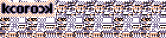

KScott's Corruptor. .rotpurroC s'ttocSK

## State of Production ##

Very, very unfinished.

My first wxGlade program.

## Install ##

This program is written in C++, and uses [wxWidgets][0] and
wxGlade as a GUI framework.

[0]: https://wxwidgets.org/

On most Linux distributions, you can install `base-devel` and
`wxgtk` or equivalent with your package manager for G++ and
wxWidgets.

e.g. `sudo pacman -Sy wxgtk base-devel`,
     `sudo apt install wxgtk build-essential`...

Other dependencies:
- [simpleini][1] (`simpleini` on the AUR)
- [wxGlade][2]   (`wxglade`   on the AUR)

[1]: https://github.com/brofield/simpleini/
[2]: http://wxglade.sourceforge.net/

On Arch, install required AUR packages: `yay -S simpleini wxglade`

On Windows, you'll likely need to use MinGW or spend like 5
hours getting this to compile on Visual Studio or MonoDevelop.

(If you do, *please* make a pull request with the SLN! <3)

Also make sure to add wxGlade to the PATH somehow on Windows
for the Makefile to work.

It's (hopefully) as simple as typing

```
git clone https://github.com/KScottDB/kcorock.git
cd kcorock
make kcorock
```

in your shell.

## .kct File Format ##

it stands for KCorock Theme

nothing to write about it yet, nor much code relating to it,
but clues of what the implementation will be are in the file
itself.

it is just plain text, ini-alike.